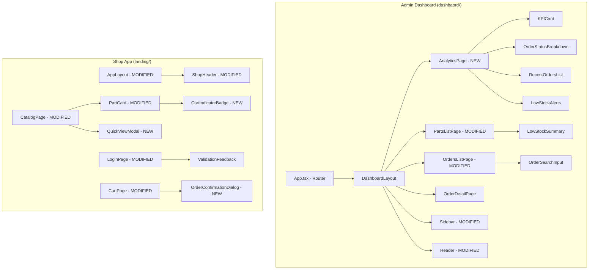

# Design Document: Dashboard Modernization

## Overview

This design covers frontend-only enhancements across two applications in the spare parts ordering system:

1. **Admin Dashboard** (`dashbaord/`): Add an analytics overview page, modernize UI with card-based layouts, improve tables, add orders search, low stock indicators, order total column, empty/loading states, and header enhancements.
2. **Shop App** (`landing/`): Add cart indicators on catalog cards, quick view modal, exact stock counts, login auto-redirect, login validation, header personalization, and order confirmation dialog.

No backend changes are required. All data is derived from existing API endpoints (`GET /orders/all`, `GET /parts`, `GET /orders`). Both apps use React + TypeScript + Tailwind CSS 4 with RTL layout and IBM Plex Sans Arabic font.

## Architecture

### High-Level Component Architecture



### Design Decisions

1. **Client-side computation for analytics**: KPIs are computed from fetched orders and parts data rather than adding backend endpoints. This keeps the scope frontend-only and leverages existing paginated/full-list endpoints.
2. **Component extraction over page-level bloat**: New UI elements (KPICard, QuickViewModal, OrderConfirmationDialog) are extracted as separate components for reusability and testability.
3. **Shared utility functions**: Computation logic (order totals, status grouping, low stock filtering, time-of-day greeting) is extracted into pure utility functions for easy unit and property testing.
4. **No new contexts or global state**: All new features use local component state or existing contexts (AuthContext, CartContext).

## Components and Interfaces

### Admin Dashboard — New Components

#### AnalyticsPage (`dashbaord/src/pages/AnalyticsPage.tsx`)
- Fetches all orders via `GET /orders/all` and all parts via `GET /parts?limit=1000`
- Computes KPIs: total orders, pending orders, total revenue, total parts count
- Renders order status breakdown, recent orders list, and low stock alerts
- Uses shared loading/error/empty state components

#### KPICard (`dashbaord/src/components/KPICard.tsx`)
```typescript
interface KPICardProps {
  title: string;       // e.g., "إجمالي الطلبات"
  value: string;       // e.g., "142" or "25,430.00 ر.س"
  icon: React.ReactNode;
  color: 'blue' | 'amber' | 'green' | 'indigo';
}
```

#### OrderStatusBreakdown (`dashbaord/src/components/OrderStatusBreakdown.tsx`)
```typescript
interface OrderStatusBreakdownProps {
  orders: Order[];
}
// Renders a card with status counts: pending, approved, preparing, ready, delivered
```

#### RecentOrdersList (`dashbaord/src/components/RecentOrdersList.tsx`)
```typescript
interface RecentOrdersListProps {
  orders: Order[];  // Full list; component takes the 5 most recent
}
```

#### LowStockAlerts (`dashbaord/src/components/LowStockAlerts.tsx`)
```typescript
interface LowStockAlertsProps {
  parts: Part[];  // Full list; component filters stock <= 5
}
```

### Admin Dashboard — Modified Components

#### DashboardLayout (Sidebar changes)
- Add "لوحة التحكم" nav link as first item, navigating to `/`
- Add `ChartIcon` SVG for the new link
- Active state highlighting via existing `NavLink` `isActive`

#### DashboardLayout (Header changes)
- Display current page title (derived from route via `useLocation`)
- Display username + role badge ("مدير") next to logout button
- Display time-of-day greeting using `getGreeting()` utility

#### PartsListPage enhancements
- Modernize container: `rounded-2xl` card with subtle border and shadow
- Add page subtitle below heading
- Alternating row colors (`even:bg-gray-50/50`)
- Uppercase column headers with bottom border
- Low stock warning icon next to stock badge when `stock <= 5`
- Red "نفذ المخزون" badge when `stock === 0`
- Low stock summary count above table

#### OrdersListPage enhancements
- Modernize container: `rounded-2xl` card with subtle border and shadow
- Add page subtitle below heading
- Alternating row colors
- Uppercase column headers
- Add search input for client-side filtering by order number or shop name
- Add "الإجمالي" (Total) column: `sum(item.quantity * item.unitPrice)` formatted as `X.XX ر.س`

### Admin Dashboard — Shared UI

#### LoadingSpinner (`dashbaord/src/components/LoadingSpinner.tsx`)
```typescript
interface LoadingSpinnerProps {
  label?: string;  // Default: "جاري التحميل..."
}
```

#### EmptyState (`dashbaord/src/components/EmptyState.tsx`)
```typescript
interface EmptyStateProps {
  icon: React.ReactNode;
  message: string;
}
```

#### ErrorState (`dashbaord/src/components/ErrorState.tsx`)
```typescript
interface ErrorStateProps {
  message?: string;
  onRetry: () => void;
}
```

### Shop App — New Components

#### QuickViewModal (`landing/src/components/QuickViewModal.tsx`)
```typescript
interface QuickViewModalProps {
  part: Part | null;
  isOpen: boolean;
  onClose: () => void;
  onAddToCart: (part: Part) => void;
  cartQuantity: number;  // Current quantity of this part in cart
}
```
- Displays: name, partNumber, price, stock, full description, image
- Stock display: "المخزون: X قطعة"
- Disabled add button + "نفذ المخزون" when stock === 0
- Closes on backdrop click or Escape key
- Uses `useEffect` for Escape key listener

#### CartIndicatorBadge (`landing/src/components/CartIndicatorBadge.tsx`)
```typescript
interface CartIndicatorBadgeProps {
  quantity: number;  // 0 means not in cart
}
```
- Blue badge showing cart quantity, positioned on the part card
- Only rendered when `quantity > 0`

#### OrderConfirmationDialog (`landing/src/components/OrderConfirmationDialog.tsx`)
```typescript
interface OrderConfirmationDialogProps {
  isOpen: boolean;
  totalAmount: number;
  itemCount: number;
  onConfirm: () => void;
  onCancel: () => void;
}
```
- Shows total amount and item count
- "تأكيد" and "إلغاء" buttons
- Closes on backdrop click or cancel

### Shop App — Modified Components

#### CatalogPage changes
- Integrate `useCart` to get `items` array for cart indicator lookup
- Add `selectedPart` state for QuickViewModal
- On card click → open QuickViewModal
- Show `CartIndicatorBadge` on cards where part is in cart
- Show exact stock count: "المخزون: X" on each card
- Amber "كمية محدودة" label when `1 <= stock <= 5`
- Red "نفذ المخزون" + disabled button when `stock === 0`

#### LoginPage changes
- Check `useAuth().user` and `isLoading` on mount
- If authenticated → `router.push('/catalog')`
- While `isLoading` → show spinner instead of form
- Add `errors` state: `{ username?: string; password?: string }`
- Validate before submit: empty username → "يرجى إدخال اسم المستخدم", empty password → "يرجى إدخال كلمة المرور"
- Clear field error on `onChange`

#### AppLayout (ShopHeader) changes
- Access `useAuth().user` to get `shopName` and `username`
- Display greeting: "أهلاً، [shopName]" (fallback to username)
- Show greeting on desktop (`hidden md:block`), hide on mobile

#### CartPage changes
- Add `showConfirmDialog` state
- On "إرسال الطلب" click → set `showConfirmDialog = true`
- Render `OrderConfirmationDialog` with total and item count
- On confirm → proceed with existing `handleSubmitOrder`
- On cancel → close dialog

### Routing Changes (Admin Dashboard)

```typescript
// App.tsx — updated routes
<Route path="/" element={<AnalyticsPage />} />  // Was: Navigate to /parts
<Route path="/parts" element={<PartsListPage />} />
<Route path="/orders" element={<OrdersListPage />} />
```

### Page Title Mapping (Header)

```typescript
const PAGE_TITLES: Record<string, string> = {
  '/': 'لوحة التحكم',
  '/parts': 'إدارة القطع',
  '/orders': 'إدارة الطلبات',
};
```

## Data Models

### Existing Types (No Changes)

Both apps share equivalent type definitions. No new types are needed for the backend. All new features derive from existing `Order`, `Part`, `User`, `OrderItem`, and `CartItem` types.

### Computed Data Structures (Client-Side Only)

```typescript
// Analytics KPIs — computed in AnalyticsPage from fetched data
interface AnalyticsKPIs {
  totalOrders: number;
  pendingOrders: number;
  totalRevenue: number;      // sum of all order items (quantity * unitPrice)
  totalParts: number;
}

// Order status breakdown — computed from orders array
interface StatusBreakdown {
  pending: number;
  approved: number;
  preparing: number;
  ready: number;
  delivered: number;
}

// Login validation errors — local state in LoginPage
interface LoginValidationErrors {
  username?: string;
  password?: string;
}
```

### Utility Functions (Pure, Testable)

```typescript
// dashbaord/src/utils/analytics.ts

/** Compute total revenue from an array of orders */
function computeTotalRevenue(orders: Order[]): number;

/** Group orders by status and return counts */
function computeStatusBreakdown(orders: Order[]): StatusBreakdown;

/** Compute order total from its items */
function computeOrderTotal(items: OrderItem[]): number;

/** Filter parts with stock <= threshold (default 5) */
function filterLowStockParts(parts: Part[], threshold?: number): Part[];

/** Get time-of-day greeting */
function getGreeting(hour: number): string;
// hour < 12 → "صباح الخير", else → "مساء الخير"

/** Filter orders by search text (order number or shop name) */
function filterOrdersBySearch(orders: Order[], searchText: string): Order[];
```

```typescript
// landing/src/utils/validation.ts

/** Validate login form fields, returns error messages */
function validateLoginForm(username: string, password: string): LoginValidationErrors;

/** Get cart quantity for a specific part */
function getCartQuantityForPart(items: CartItem[], partId: number): number;

/** Format stock display text */
function formatStockDisplay(stock: number): { text: string; color: 'green' | 'amber' | 'red' };
```


## Correctness Properties

*A property is a characteristic or behavior that should hold true across all valid executions of a system — essentially, a formal statement about what the system should do. Properties serve as the bridge between human-readable specifications and machine-verifiable correctness guarantees.*

### Property 1: Revenue computation is sum of all order item totals

*For any* array of orders, each containing any number of order items, `computeTotalRevenue(orders)` should equal the sum of `(quantity × unitPrice)` for every item across every order.

**Validates: Requirements 1.2**

### Property 2: Status breakdown counts sum to total orders

*For any* array of orders, the sum of all status counts returned by `computeStatusBreakdown(orders)` should equal the total number of orders in the input array.

**Validates: Requirements 1.3**

### Property 3: Recent orders are sorted by date descending and capped at 5

*For any* array of orders, the recent orders list should contain at most 5 orders, and each order's `createdAt` should be greater than or equal to the next order's `createdAt` in the list.

**Validates: Requirements 1.4**

### Property 4: Low stock filter returns exactly parts with stock at or below threshold

*For any* array of parts and a threshold value, `filterLowStockParts(parts, threshold)` should return exactly those parts where `stock <= threshold`, and the count of returned parts should equal the number of parts in the original array satisfying that condition.

**Validates: Requirements 1.5, 6.1, 6.3**

### Property 5: Order search filter returns only matching orders

*For any* array of orders and any non-empty search string, `filterOrdersBySearch(orders, searchText)` should return only orders where `orderNumber` or `user.shopName` contains the search text (case-insensitive), and every order matching that criterion should be included.

**Validates: Requirements 5.2**

### Property 6: Order total equals sum of item line totals

*For any* order with any array of order items, `computeOrderTotal(items)` should equal the sum of `(quantity × unitPrice)` for each item, and the formatted result should match the pattern `X.XX ر.س`.

**Validates: Requirements 7.1, 7.2**

### Property 7: Time-of-day greeting is correct for all hours

*For any* hour value from 0 to 23, `getGreeting(hour)` should return "صباح الخير" when `hour < 12` and "مساء الخير" when `hour >= 12`.

**Validates: Requirements 9.3**

### Property 8: Cart quantity lookup returns correct quantity

*For any* array of cart items and any part ID, `getCartQuantityForPart(items, partId)` should return the quantity of the matching cart item, or 0 if the part is not in the cart.

**Validates: Requirements 10.1, 10.2**

### Property 9: Adding a part to cart increments its quantity by exactly 1

*For any* cart state and any part, calling `addToCart(part)` should result in the cart quantity for that part being exactly 1 more than before the call.

**Validates: Requirements 10.3**

### Property 10: Stock display formatting matches stock level

*For any* part with `stock > 5`, `formatStockDisplay` should return green color. *For any* part with `1 <= stock <= 5`, it should return amber color with "كمية محدودة" label. *For any* part with `stock === 0`, it should return red color with "نفذ المخزون" text.

**Validates: Requirements 11.4, 12.1, 12.2**

### Property 11: Login validation catches empty fields

*For any* username that is empty or whitespace-only, `validateLoginForm` should return an error for the username field. *For any* password that is empty or whitespace-only, it should return an error for the password field. *For any* non-empty, non-whitespace username and password, it should return no errors.

**Validates: Requirements 14.1, 14.2**

### Property 12: Shop header greeting uses shopName with username fallback

*For any* user with a non-empty `shopName`, the greeting should be "أهلاً، [shopName]". *For any* user where `shopName` is undefined or empty, the greeting should be "أهلاً، [username]".

**Validates: Requirements 15.2, 15.3**

## Error Handling

### Admin Dashboard

| Scenario | Behavior |
|---|---|
| API fetch fails (orders or parts) | Display `ErrorState` component with error message and "إعادة المحاولة" retry button. Retry re-triggers the fetch. |
| Partial data load (orders succeed, parts fail) | Show available data with error state for the failed section only. |
| Empty data (no orders/parts) | Display `EmptyState` with relevant icon and message per page context. |
| Loading state | Display `LoadingSpinner` centered with "جاري التحميل..." label. |

### Shop App

| Scenario | Behavior |
|---|---|
| Login validation failure | Display inline error messages below respective fields. Do not send API request. |
| Login API failure | Display existing error banner "بيانات الدخول غير صحيحة". |
| Order submission failure | Display error message in cart page. Confirmation dialog closes. |
| Auth check loading | Show spinner on login page instead of form. |
| QuickViewModal for out-of-stock part | Disable "أضف للسلة" button, show "نفذ المخزون" text. |

## Testing Strategy

### Dual Testing Approach

Both unit tests and property-based tests are required for comprehensive coverage.

### Property-Based Testing

- **Library**: `fast-check` for both apps (React/TypeScript ecosystem)
- **Configuration**: Minimum 100 iterations per property test
- **Tag format**: `Feature: dashboard-modernization, Property {number}: {property_text}`
- Each correctness property (1–12) maps to exactly one property-based test

Property tests target the pure utility functions:
- `dashbaord/src/utils/analytics.ts`: Properties 1–7 (computeTotalRevenue, computeStatusBreakdown, filterLowStockParts, filterOrdersBySearch, computeOrderTotal, getGreeting)
- `landing/src/utils/validation.ts`: Property 11 (validateLoginForm)
- `landing/src/utils/catalog.ts`: Properties 8, 10 (getCartQuantityForPart, formatStockDisplay)
- `landing/src/utils/header.ts`: Property 12 (greeting logic)
- `landing/src/context/CartContext.tsx`: Property 9 (addToCart increment, tested via the context or extracted logic)

### Unit Tests

Unit tests cover specific examples, edge cases, and integration points:

- **Edge cases**: Zero stock display (6.2, 11.5, 12.3), empty order items array, empty parts array
- **UI integration**: Sidebar link rendering and ordering (2.1–2.3), modal open/close behavior (11.1–11.3), confirmation dialog flow (16.1–16.4), login redirect (13.1–13.3)
- **Rendering checks**: KPI cards display correct values, page titles in header (9.1–9.2), loading/empty/error states (8.1–8.3)

### Test File Organization

```
dashbaord/src/utils/__tests__/analytics.test.ts     — Properties 1-7
landing/src/utils/__tests__/validation.test.ts       — Property 11
landing/src/utils/__tests__/catalog.test.ts          — Properties 8, 10
landing/src/utils/__tests__/header.test.ts           — Property 12
landing/src/context/__tests__/CartContext.test.tsx    — Property 9
```
