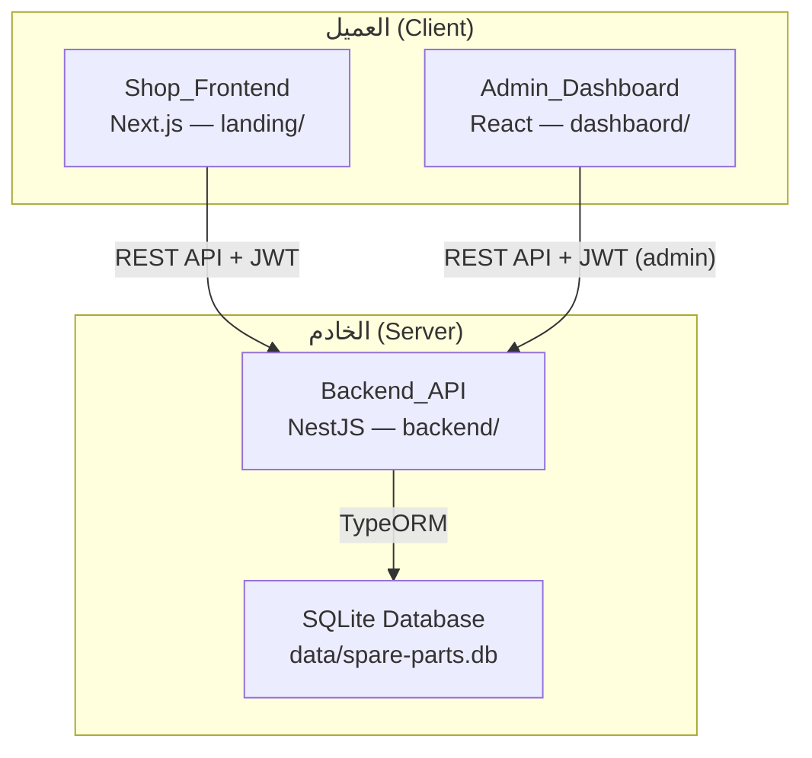
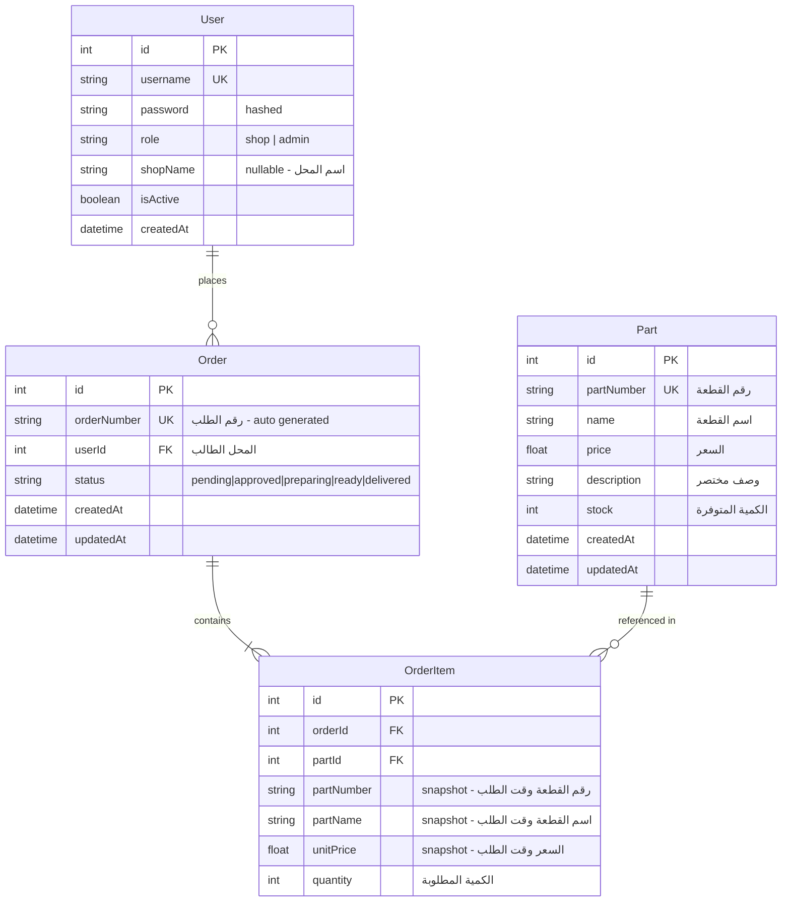

# التصميم التقني — نظام طلب قطع الغيار للمحلات المعتمدة

## نظرة عامة (Overview)

نظام ويب يتكون من ثلاثة أجزاء رئيسية يعمل كمنصة موحدة لطلب قطع الغيار بين تجار الجملة والمحلات المعتمدة في السعودية:

1. **Shop_Frontend** (Next.js — مجلد `landing/`): واجهة المحلات للبحث عن القطع وإنشاء الطلبات ومتابعتها
2. **Admin_Dashboard** (React — مجلد `dashbaord/`): لوحة تحكم المخزن والإدارة لإدارة المنتجات والطلبات
3. **Backend_API** (NestJS — مجلد `backend/`): الخادم الخلفي الذي يعالج المنطق التجاري ويدير البيانات

### قرارات التصميم الرئيسية

| القرار | الاختيار | السبب |
|--------|----------|-------|
| قاعدة البيانات | SQLite + TypeORM | أبسط خيار للـ MVP — لا يحتاج إعداد خادم خارجي، ملف واحد |
| المصادقة | JWT (Access Token) | بسيط وعديم الحالة (stateless)، مناسب لنظام بثلاث واجهات |
| التنسيق | Tailwind CSS + RTL | سريع التطوير، دعم ممتاز لـ RTL عبر `dir="rtl"` |
| إدارة الحالة (Shop) | React Context + localStorage | كافٍ للسلة والمصادقة بدون مكتبات إضافية |
| إدارة الحالة (Dashboard) | React Context | كافٍ لحجم التطبيق |
| الخط العربي | IBM Plex Sans Arabic | خط مجاني واضح ومقروء، متوفر عبر Google Fonts |


## الهيكل المعماري (Architecture)



### نمط الاتصال

- جميع الاتصالات عبر REST API مع JSON
- المصادقة عبر JWT في header: `Authorization: Bearer <token>`
- الـ Backend يخدم كلا الواجهتين عبر نفس الـ API مع فصل الصلاحيات عبر Guards
- CORS مُفعّل للسماح بالطلبات من الواجهتين

### هيكل المجلدات

```
project-root/
├── backend/                    # NestJS Backend API
│   └── src/
│       ├── auth/               # مصادقة JWT + Guards
│       ├── parts/              # إدارة القطع (CRUD)
│       ├── orders/             # إدارة الطلبات
│       ├── users/              # إدارة المستخدمين (shops + staff)
│       └── database/           # إعداد TypeORM + SQLite
├── dashbaord/                  # React Admin Dashboard
│   └── src/
│       ├── components/         # مكونات مشتركة
│       ├── pages/              # صفحات اللوحة
│       ├── context/            # Auth context
│       ├── api/                # دوال الاتصال بالـ API
│       └── types/              # TypeScript types
├── landing/                    # Next.js Shop Frontend
│   └── src/
│       ├── app/                # صفحات Next.js (App Router)
│       │   ├── login/          # تسجيل الدخول
│       │   ├── catalog/        # كتالوج القطع
│       │   ├── cart/           # سلة الطلب
│       │   └── orders/         # متابعة الطلبات
│       ├── components/         # مكونات مشتركة
│       ├── context/            # Auth + Cart context
│       ├── lib/                # دوال مساعدة + API client
│       └── types/              # TypeScript types
└── mvp_business.txt
```


## المكونات والواجهات (Components and Interfaces)

### 1. Backend_API — الوحدات (NestJS Modules)

#### AuthModule
- **AuthController**: `POST /api/auth/login` — تسجيل دخول المحلات والإدارة
- **AuthService**: التحقق من بيانات الدخول وإصدار JWT
- **JwtAuthGuard**: حماية المسارات المحمية
- **AdminGuard**: حماية مسارات الإدارة فقط (role = admin)
- **JwtStrategy**: استراتيجية Passport لفك تشفير JWT

#### PartsModule
- **PartsController**:
  - `GET /api/parts` — جلب القطع مع pagination والبحث (للمحلات)
  - `GET /api/parts/:id` — جلب قطعة واحدة
  - `POST /api/parts` — إضافة قطعة (admin فقط)
  - `PUT /api/parts/:id` — تعديل قطعة (admin فقط)
- **PartsService**: منطق إدارة القطع والبحث

#### OrdersModule
- **OrdersController**:
  - `POST /api/orders` — إنشاء طلب جديد (محل معتمد)
  - `GET /api/orders` — جلب طلبات المحل الحالي
  - `GET /api/orders/all` — جلب جميع الطلبات (admin فقط)
  - `GET /api/orders/:id` — تفاصيل طلب
  - `PATCH /api/orders/:id/status` — تحديث حالة الطلب (admin فقط)
- **OrdersService**: منطق إدارة الطلبات وتحديث الحالات

#### UsersModule
- **UsersService**: جلب بيانات المستخدمين للمصادقة
- لا يوجد controller عام — إدارة المستخدمين تتم عبر seed أو مباشرة في قاعدة البيانات للـ MVP

### 2. واجهات الـ API (API Contracts)

#### تسجيل الدخول
```typescript
// POST /api/auth/login
// Request
{ "username": string, "password": string }

// Response 200
{ "access_token": string, "user": { "id": number, "username": string, "role": "shop" | "admin", "shopName"?: string } }

// Response 401
{ "message": "بيانات الدخول غير صحيحة" }
```

#### القطع
```typescript
// GET /api/parts?page=1&limit=20&search=فلتر
// Response 200
{
  "data": [{ "id": number, "partNumber": string, "name": string, "price": number, "description": string, "stock": number }],
  "total": number,
  "page": number,
  "limit": number
}

// POST /api/parts (admin)
// Request
{ "partNumber": string, "name": string, "price": number, "description": string, "stock": number }

// Response 201
{ "id": number, "partNumber": string, "name": string, "price": number, "description": string, "stock": number }
```

#### الطلبات
```typescript
// POST /api/orders
// Request
{ "items": [{ "partId": number, "quantity": number }] }

// Response 201
{ "id": number, "orderNumber": string, "status": "pending", "createdAt": string, "items": [...] }

// PATCH /api/orders/:id/status (admin)
// Request
{ "status": "approved" | "preparing" | "ready" | "delivered" }

// Response 200
{ "id": number, "orderNumber": string, "status": string, "updatedAt": string }
```

### 3. Shop_Frontend — المكونات الرئيسية

| المكون | الوصف |
|--------|-------|
| `LoginPage` | صفحة تسجيل الدخول — نموذج بسيط مع username/password |
| `CatalogPage` | عرض القطع مع بحث وpagination |
| `PartCard` | بطاقة عرض قطعة واحدة مع زر إضافة للسلة |
| `SearchBar` | حقل بحث مع debounce 500ms |
| `CartPage` | عرض محتويات السلة مع تعديل الكميات |
| `CartIcon` | أيقونة السلة في الـ header مع عدد العناصر |
| `OrdersPage` | قائمة طلبات المحل مع الحالة |
| `OrderDetailPage` | تفاصيل طلب واحد |
| `AuthProvider` | Context للمصادقة وحالة تسجيل الدخول |
| `CartProvider` | Context للسلة مع حفظ في localStorage |
| `AppLayout` | Layout رئيسي مع header وnavigation — RTL |

### 4. Admin_Dashboard — المكونات الرئيسية

| المكون | الوصف |
|--------|-------|
| `LoginPage` | صفحة تسجيل دخول الإدارة |
| `DashboardLayout` | Layout رئيسي مع sidebar navigation — RTL |
| `PartsListPage` | جدول القطع مع خيارات إضافة/تعديل |
| `PartFormModal` | نموذج إضافة/تعديل قطعة |
| `OrdersListPage` | قائمة الطلبات مع فلترة حسب الحالة |
| `OrderDetailPage` | تفاصيل الطلب مع أزرار تحديث الحالة |
| `OrderPrintView` | عرض الطلب للطباعة — تنسيق A4 |
| `StatusBadge` | شارة حالة الطلب بألوان مميزة |
| `AuthProvider` | Context للمصادقة |


## نماذج البيانات (Data Models)

### مخطط العلاقات



### TypeORM Entities

#### User Entity
```typescript
@Entity()
export class User {
  @PrimaryGeneratedColumn()
  id: number;

  @Column({ unique: true })
  username: string;

  @Column()
  password: string; // bcrypt hashed

  @Column({ type: 'text', default: 'shop' })
  role: 'shop' | 'admin';

  @Column({ nullable: true })
  shopName: string;

  @Column({ default: true })
  isActive: boolean;

  @CreateDateColumn()
  createdAt: Date;

  @OneToMany(() => Order, (order) => order.user)
  orders: Order[];
}
```

#### Part Entity
```typescript
@Entity()
export class Part {
  @PrimaryGeneratedColumn()
  id: number;

  @Column({ unique: true })
  partNumber: string;

  @Column()
  name: string;

  @Column({ type: 'float' })
  price: number;

  @Column({ type: 'text', default: '' })
  description: string;

  @Column({ type: 'int', default: 0 })
  stock: number;

  @CreateDateColumn()
  createdAt: Date;

  @UpdateDateColumn()
  updatedAt: Date;
}
```

#### Order Entity
```typescript
@Entity()
export class Order {
  @PrimaryGeneratedColumn()
  id: number;

  @Column({ unique: true })
  orderNumber: string; // e.g., "ORD-20240101-001"

  @ManyToOne(() => User, (user) => user.orders)
  user: User;

  @Column()
  userId: number;

  @Column({ type: 'text', default: 'pending' })
  status: 'pending' | 'approved' | 'preparing' | 'ready' | 'delivered';

  @CreateDateColumn()
  createdAt: Date;

  @UpdateDateColumn()
  updatedAt: Date;

  @OneToMany(() => OrderItem, (item) => item.order, { cascade: true })
  items: OrderItem[];
}
```

#### OrderItem Entity
```typescript
@Entity()
export class OrderItem {
  @PrimaryGeneratedColumn()
  id: number;

  @ManyToOne(() => Order, (order) => order.items)
  order: Order;

  @Column()
  orderId: number;

  @ManyToOne(() => Part)
  part: Part;

  @Column()
  partId: number;

  @Column()
  partNumber: string; // snapshot at order time

  @Column()
  partName: string; // snapshot at order time

  @Column({ type: 'float' })
  unitPrice: number; // snapshot at order time

  @Column({ type: 'int' })
  quantity: number;
}
```

### قرارات تصميم البيانات

- **Snapshots في OrderItem**: يتم حفظ رقم القطعة واسمها وسعرها وقت إنشاء الطلب، حتى لو تغيرت بيانات القطعة لاحقاً يبقى الطلب يعكس البيانات الصحيحة
- **Order Number**: يُولّد تلقائياً بصيغة `ORD-YYYYMMDD-XXX` لسهولة التعرف والطباعة
- **Status Flow**: الحالات تتبع مساراً خطياً: `pending → approved → preparing → ready → delivered` — لا يمكن الرجوع لحالة سابقة
- **Password Hashing**: كلمات المرور تُخزّن مشفرة بـ bcrypt
- **Soft User Management**: للـ MVP، المستخدمون يُضافون عبر seed script أو مباشرة — لا توجد واجهة تسجيل ذاتي


## خصائص الصحة (Correctness Properties)

*الخاصية (Property) هي سلوك أو صفة يجب أن تكون صحيحة في جميع حالات تشغيل النظام — بمعنى آخر، هي تعريف رسمي لما يجب أن يفعله النظام. الخصائص تربط بين المتطلبات المكتوبة للبشر وضمانات الصحة القابلة للتحقق آلياً.*

### Property 1: المصادقة تُرجع token مع الدور الصحيح

*For any* valid username/password combination in the system, calling the login endpoint should return a valid JWT access token where the decoded role matches the user's actual role (shop or admin).

**Validates: Requirements 1.1, 2.1**

### Property 2: بيانات الدخول الخاطئة تُرجع رسالة خطأ موحدة

*For any* invalid credentials (wrong username, wrong password, or both), the login endpoint should return the same generic error message without revealing which field is incorrect.

**Validates: Requirements 1.2, 2.2**

### Property 3: المسارات المحمية تُعيد التوجيه بدون مصادقة

*For any* protected route in the Shop_Frontend, accessing it without a valid authentication token should redirect to the login page.

**Validates: Requirements 1.3**

### Property 4: حالة المصادقة تبقى عبر التنقل

*For any* authenticated shop session and any sequence of page navigations within the Shop_Frontend, the authentication state should remain active and the user should not be logged out.

**Validates: Requirements 1.5**

### Property 5: بيانات القطعة كاملة في الاستجابة

*For any* Part stored in the database, fetching it via the API should return an object containing all required fields: partNumber, name, price, description, and stock — with values matching what was stored.

**Validates: Requirements 3.1, 3.4**

### Property 6: البحث يُرجع نتائج مطابقة فقط

*For any* search query string and any set of parts in the catalog, every part in the search results should have either a Part_Number or name that contains the search query as a substring.

**Validates: Requirements 4.1**

### Property 7: مسح البحث يُعيد الكتالوج الكامل

*For any* catalog state, after performing a search and then clearing the search field, the displayed parts should be identical to the full catalog (round-trip).

**Validates: Requirements 4.4**

### Property 8: إضافة قطعة للسلة تزيد عدد العناصر

*For any* part not already in the cart, adding it should increase the cart item count by one and set the quantity to 1.

**Validates: Requirements 5.1**

### Property 9: إجمالي السلة يعكس الكميات بدقة

*For any* cart state and any sequence of quantity changes (increase, decrease, remove), the displayed cart total should always equal the sum of all item quantities in the cart.

**Validates: Requirements 5.2, 5.3, 5.4**

### Property 10: السلة تنجو من إعادة تحميل الصفحة (round-trip)

*For any* cart state with items, serializing the cart to localStorage and then deserializing it should produce an equivalent cart with the same items and quantities.

**Validates: Requirements 5.6**

### Property 11: إنشاء الطلب يحفظ جميع البيانات بحالة "قيد الانتظار"

*For any* valid cart submission from an authenticated shop, the created order should have status "pending", contain the shop's identity, a timestamp, and all submitted items with their correct quantities.

**Validates: Requirements 6.1, 6.4**

### Property 12: الطلب الناجح يُفرغ السلة

*For any* successful order submission, the cart should be cleared (empty) and a confirmation with the order number should be available.

**Validates: Requirements 6.2**

### Property 13: الطلبات مرتبة من الأحدث للأقدم

*For any* shop with multiple orders, the orders list returned by the API should be sorted by creation date in descending order (newest first).

**Validates: Requirements 7.1**

### Property 14: حالة الطلب تُعرض بتسميات عربية صحيحة

*For any* order status value (pending, approved, preparing, ready, delivered), the status display mapping should return the correct Arabic label (قيد الانتظار، معتمد، قيد التحضير، جاهز، تم التسليم).

**Validates: Requirements 7.2**

### Property 15: المحل يرى طلباته فقط

*For any* authenticated shop, the orders API should return only orders belonging to that shop and never include orders from other shops.

**Validates: Requirements 7.4**

### Property 16: إنشاء وتعديل القطع (round-trip)

*For any* valid part data, creating a part via the API and then fetching it should return the same data. Similarly, updating any field and then fetching should reflect the updated values.

**Validates: Requirements 8.1, 8.2**

### Property 17: انتقالات حالة الطلب صحيحة

*For any* order, advancing the status should only succeed when following the valid sequence (pending → approved → preparing → ready → delivered). Attempting to skip a status or go backwards should be rejected.

**Validates: Requirements 9.2, 9.3, 9.4, 9.5**

### Property 18: فلترة الطلبات حسب الحالة

*For any* status filter applied to the orders list, every returned order should have a status matching the filter.

**Validates: Requirements 9.6**

### Property 19: تفاصيل الطلب كاملة

*For any* order in the system, the order detail response should include: order number, shop name, order date, all parts with Part_Number, name, quantity, price, and current status.

**Validates: Requirements 7.3, 9.7**

### Property 20: عرض الطباعة يحتوي جميع البيانات المطلوبة

*For any* order, the print view should contain: order number, shop name, order date, and a list of all parts with Part_Number, name, quantity, and price.

**Validates: Requirements 10.2**


## معالجة الأخطاء (Error Handling)

### Backend_API — أكواد الاستجابة

| الحالة | الكود | الرسالة |
|--------|-------|---------|
| بيانات دخول خاطئة | 401 | `بيانات الدخول غير صحيحة` |
| غير مصرّح | 401 | `يرجى تسجيل الدخول` |
| صلاحيات غير كافية | 403 | `ليس لديك صلاحية لهذا الإجراء` |
| عنصر غير موجود | 404 | `العنصر المطلوب غير موجود` |
| رقم قطعة مكرر | 409 | `رقم القطعة موجود مسبقاً` |
| بيانات غير صالحة | 400 | رسالة توضح الحقل المطلوب |
| انتقال حالة غير صالح | 400 | `لا يمكن تغيير الحالة من X إلى Y` |
| خطأ داخلي | 500 | `حدث خطأ، يرجى المحاولة لاحقاً` |

### استراتيجية معالجة الأخطاء

#### Backend
- **NestJS Exception Filters**: فلتر عام يلتقط جميع الأخطاء ويُرجع رسائل عربية موحدة
- **Validation Pipe**: استخدام `class-validator` للتحقق من صحة البيانات الواردة مع رسائل عربية
- **TypeORM Errors**: التقاط أخطاء قاعدة البيانات (مثل unique constraint) وتحويلها لرسائل مفهومة
- **JWT Errors**: التقاط انتهاء صلاحية الـ token وإرجاع 401

#### Shop_Frontend
- **API Error Interceptor**: اعتراض أخطاء الـ API وعرض رسائل toast بالعربية
- **401 Auto-redirect**: عند انتهاء صلاحية الـ token، إعادة التوجيه تلقائياً لصفحة الدخول
- **Network Errors**: عرض رسالة "تعذر الاتصال بالخادم" عند فشل الاتصال
- **Form Validation**: التحقق من الحقول قبل الإرسال مع رسائل خطأ واضحة بالعربية
- **Empty Cart Guard**: منع إرسال طلب فارغ مع رسالة توضيحية

#### Admin_Dashboard
- نفس استراتيجية Shop_Frontend مع إضافة:
- **Status Transition Errors**: عرض رسالة واضحة عند محاولة انتقال حالة غير صالح
- **Duplicate Part Number**: عرض رسالة عند محاولة إضافة رقم قطعة موجود مسبقاً

### تنسيق رسائل الخطأ من الـ API

```typescript
// Standard error response format
{
  "statusCode": number,
  "message": string,        // رسالة عربية للعرض
  "error": string           // نوع الخطأ التقني
}
```

